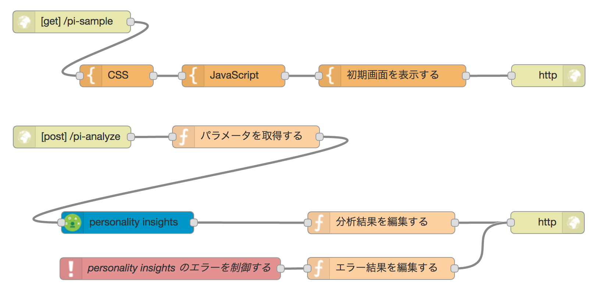

# IBM Bluemix - Personality Insights Sample (Node-RED 版)

## ハンズオン手順

### アプリの作成
1. Bluemix コンソールにログインします。
1. 『カタログ』リンク、もしくは『アプリの作成』ボタンをクリック。
1. 『ボイラープレート』カテゴリの中から、『Node-RED Starter』をクリック。
1. 『アプリ名』に任意のアプリケーション名を入力します。
  - このアプリケーション名はURLの一部になりますので、使用できる文字種に制約があります。使用できる文字種は、英字・数字・ハイフンです。
  - アプリケーション名は Bluemix 内でユニークでなければなりません。ご自分の名前や日付を入れることで、他者との重複を避けるようにしてください。  
1. 『作成』ボタンをクリックし、アプリの起動を待ちます。
  - 『状況』欄のアイコンが緑色の丸に変わります
1. アプリケーションのメモリを以下のように変更して、『保存』ボタンをクリックし、ランタイムの起動を待ちます。(性格分析アプリで十分なメモリを確保するため)  
  - 512MB(インスタンス当たり) → 1GB(インスタンス当たり) 

### Personality Insights サービスの作成・バインド
1. コンソール左側の『接続』をクリック。
1. 画面右側にある『新規に接続』ボタンをクリック。
1. 画面左側のカテゴリーから『Watson』をクリック。
1. 『Personality Insights』をクリック。
1. 既にサービス名が入力されているので、特に変更しない場合はそのまま『作成』ボタンをクリック。
1. 『アプリの再ステージ』のウィンドウが表示されるので、『再ステージ』ボタンをクリック。
1. 再ステージが完了するまで待ちます。

### 性格分析アプリの作成
1. Node-RED flow editor を開く。
1. エディタ画面左側のノード一覧から、『入力』カテゴリーの『http』ノードをマウスでドラッグし、画面中央のキャンバスにドロップする。
1. httpノードをダブルクリックし、以下の値を設定し、『完了』ボタンをクリック。
  - メソッド：GET
  - URL：/pi-sample
1. ノード一覧の『機能』カテゴリーから、『template』ノードをドラッグ&ドロップする。
1. templateノードをダブルクリックし、以下の設定を行う。
  - Name：初期画面を表示する
  - Template：ダウンロードした pi-sample.html をコピー＆ペースト
1. ノード一覧の『出力』カテゴリーから、『http response』ノードをドラッグ&ドロップする。
1. httpノード → templateノード → http responseノードの順にフローを接続する。
1. ノード一覧の『入力』カテゴリーから、『http』ノードをドラッグ&ドロップする。
1. httpノードをダブルクリックし、以下の値を設定して『完了』をクリック。
  - メソッド：POST
  - URL：/pi-analyze
1. ノード一覧の『機能』カテゴリーから『function』ノードをドラッグ&ドロップする。
1. functionノードをダブルクリックし、以下の値を設定する。
  - Name：パラメータを取得する
  - Function：

        msg.payload = msg.req.body.text;  
        return msg;
             
1. ノード一覧の『IBM Watson』カテゴリーから『personality insights』ノードをドラッグ&ドロップする。
1. personality insightsノードをダブルクリックし、以下の値を設定する。なお、 サービスはバインド済みのため接続情報の設定項目は表示されません。
  - Input Text Language：Japanese
  - Language For Response：Japanese
  - Raw Scores：チェック
  - Consumption Preferences：チェック
1. ノード一覧の『機能』カテゴリーから『function』ノードをドラッグ&ドロップする。
1. functionノードをダブルクリックし、以下の値を設定する。
  - Name：分析結果を編集する
  - Function：

          msg.payload = msg.insights;  
          return msg;  

1. ノード一覧の『出力』カテゴリーから、『http response』ノードをドラッグ&ドロップする。
1. httpノード → functionノード → personality insightsノード → functionノード → http responseノードの順にフローを接続する。
1. 『デプロイ』ボタンをクリックする。

### 完成したフロー定義の例

エクスポートしたフロー定義は以下です。  
[docs/flow.json](flow.json)

### 性格分析アプリの実行
1. ブラウザに新しいタブを開き、以下のURLにアクセスする。
  - http://[アプリ名].mybluemix.net/pi-sample
1. 任意のテキストを入力して、『分析する』ボタンをクリックしてください。
  - 例) 第192回国会における安倍内閣総理大臣の所信表明演説 (全文をコピー&ペーストできます。)  
    - https://www.jimin.jp/news/parliament/133177.html
